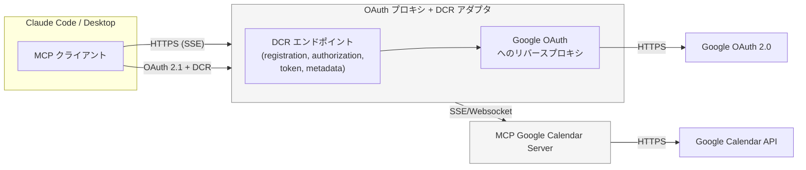

# Google Calendar MCP サーバー — 設計メモ

## 概要

このサービスは Model Context Protocol (MCP) を介して Google カレンダーと安全に連携するためのブリッジを提供します。エージェントクライアントは OAuth 認証を開始し、更新可能なアクセストークンを保存しつつ、破壊的でない予定操作（`list` / `get` / `create` / `update`）を実行できます。誤操作によるデータ消失を避けるため、削除操作は意図的に実装していません。

## アーキテクチャ

- **HTTP ファサード（Axum 0.8）** — OAuth エンドポイント (`/oauth/authorize`, `/oauth/callback`) と JSON ベースの MCP 用エンドポイント (`/mcp/tool`) を提供します。
- **Remote MCP トランスポート（`rmcp::transport::sse_server`）** — `/mcp` (SSE) と `/mcp/message` で MCP 通信を提供し、接続ごとに新しい `CalendarService` を立ち上げます。
- **OAuth モジュール（`src/oauth`）** — `oauth2` クレートを用いて PKCE チャレンジ、認可コード交換、トークン更新、トークン永続化を扱います。
- **トークンストレージ**
  - `FileTokenStorage` — `config/tokens.json` に永続化。`RwLock` でキャッシュを保護し、将来的に別ストレージへ差し替えられる構造です。
  - `InMemoryTokenStorage` — テスト用途や短時間のデモ向けにメモリのみで完結します。
- **Google カレンダー クライアント（`src/google_calendar`）** — `reqwest` を利用した薄いラッパーで、型安全なリクエスト／レスポンスと RFC3339 形式の時刻処理を提供します。
- **MCP サーバー（`src/mcp`）** — `#[tool]` で注釈したメソッドを RMCP `ServerHandler` として公開し、クライアント要求を Google API 呼び出しに変換します。HTTP 経由でのテスト用に `/mcp/tool` エンドポイントも残しています。

### オプション B: Dynamic Client Registration 対応の OAuth プロキシ

Claude Code など、OAuth 2.1 + Dynamic Client Registration (DCR) を必須とする MCP クライアントと連携する場合は、DCR に対応した HTTPS リバースプロキシを間に挟みます。プロキシは以下を提供する必要があります。

- `/.well-known/oauth-authorization-server` で `registration_endpoint` 等を含むメタデータを返す。
- `POST /register` で MCP クライアント向けのクライアント資格情報を払い出す（内部的には Google の固定クライアントを利用）。
- 認可エンドポイント／トークンエンドポイントを Google OAuth にブリッジする。
- HTTPS 終端（Let’s Encrypt や mkcert など）を行い、Claude Code から `https://` でアクセスできるようにする。

Mermaid による構成図:

# End of Selection

運用時の注意点:

- プロキシ用のドメインと TLS 証明書を用意し、`https://mcp-proxy.example.com` のような URL で公開する。
- Google のクライアント ID / シークレットはプロキシ内部に保持し、外部（MCP クライアント）には DCR で払い出す資格情報のみを見せる。
- Claude Code や `.mcp.json` などの設定では、生の Axum サーバーではなくプロキシの URL を指定する。
- 複数の MCP サーバーを同じプロキシで扱う場合は、リソースメタデータを分離できるように設計する。

## リクエストフロー

1. エージェントが `/mcp/tool` を呼び出す。
2. トークンが未保存の場合、サーバーは `401` とともに認可 URL（PKCE の state を含む）を返す。
3. ユーザーが認可フローを完了すると、Google から `/oauth/callback` にリダイレクトされる。
4. コールバックでトークンを交換＆保存し、以後はツール呼び出しが成功する。

## Remote MCP 公開戦略

Claude Code など外部クライアントへサーバーを公開する際の選択肢と推奨度を以下にまとめる。

| 選択肢 | 推奨度 | 概要 | メリット | 注意点 |
|---|---|---|---|---|
| **A. Google Cloud Run + Cloud Load Balancing** | ◎ | Axum サーバーをコンテナ化して Cloud Run にデプロイし、Managed TLS とカスタムドメインで公開する。DCR エンドポイントはサーバー内の `/proxy/oauth/...` をそのまま利用。 | ・完全マネージド / 自動スケール ・証明書が自動更新 ・Google OAuth 設定との親和性が高い | 初回は `gcloud run deploy` 等のセットアップが必要。`server.public_url` と OAuth リダイレクト URI を公開ドメインに合わせる。永続ストレージが必要な場合は Cloud Storage / Firestore 等を検討。 |
| **B. Shuttle.dev** | ○ | Rust 向けのホスティングに `cargo shuttle deploy` でデプロイ。Axum + SSE に対応し、カスタムドメインや Postgres 連携も提供。 | ・Rust 開発者向けで設定が簡単 ・無料枠あり ・GitHub Actions 連携が容易 | HTTPS 終端と DCR レイヤーはアプリ側で提供する必要がある。カスタムドメインは有料プラン要確認。ファイル永続化は Shuttle の Secrets/Storage 機能を利用。 |
| **C. VPS / 独自サーバー + Caddy** | ○ | DigitalOcean / Linode / EC2 などの VM に直接デプロイし、Caddy で HTTPS + DCR プロキシを構成。 | ・完全にカスタマイズ可能 ・既存の Caddyfile を流用できる | OS メンテナンス・証明書更新・systemd 管理が必要。`config/tokens.json` を安全に保護する仕組みを整える。 |
| **D. Azure Container Apps** | △ | Azure のマネージドコンテナ基盤にデプロイし、Front Door/Ingress で HTTPS 公開。 | ・オートスケールと監視が充実 ・Azure AD 等との統合が容易 | DCR エンドポイントを組み込む必要がある。料金・構成がやや複雑。 |
| **E. Cloudflare Workers / Tunnel + 任意の Compute** | △ | Axum サーバーを別の Compute（VPS や Cloud Run 等）に置き、Cloudflare Tunnel や Workers で HTTPS + DCR を提供。 | ・グローバルエッジ / WAF / Access が利用可 | Tunnel 常駐プロセスやカスタムハンドラが必要。Workers で全処理を完結させる場合は Rust コードの書き換えが必要。 |
| **F. STDIO MCP サーバー (ローカル連携)** | △ | `rmcp::transport::stdio_server` を利用し、エージェントと同一マシン内で標準入出力通信を行う。 | ・ネットワーク公開が不要 ・OAuth をサーバープロセス内で完結できる | 対応クライアントが限られる (Claude Code は Remote MCP 推奨)。各端末でプロセス常駐が必要。 |

### 推奨デプロイ手順 (A案)
1. Axum サーバーは内部ポート (例: `127.0.0.1:8080`) で起動し、`server.public_url` を公開ドメイン (`https://mcp.example.com`) に合わせる。
2. Caddy/Nginx 等で `https://mcp.example.com/mcp` → `http://127.0.0.1:8080/mcp` をリバースプロキシする。SSE は長時間接続となるため、タイムアウトを十分に延ばす。
3. プロキシ側で DCR エンドポイント (`/.well-known/oauth-authorization-server`, `/proxy/oauth/register` 等) を実装し、Google OAuth の固定クライアントと橋渡しする。
4. Claude 側設定 (`.mcp.json` やワークスペース設定) でプロキシ URL を指定する。
5. 初回接続後、サーバーログの `stored bearer token from headers`/`updated bearer token from headers` を確認し、`config/tokens.json` へトークンが保存されているか検証する。

### 運用チェックリスト
- TLS 証明書の有効期限監視 (mkcert なら端末ごとの再発行手順、Let’s Encrypt なら自動更新ジョブ)
- プロキシのアイドルタイムアウト設定 (SSE のため keep-alive を長めに設定)
- Google Cloud Console のリダイレクト URI が最新のプロキシ構成と一致しているか (`/proxy/oauth/callback` 等)
- 障害解析手順として、`.claude/debug/latest` とサーバーの `latest.log` をタイムスタンプで突き合わせるフローを README/Runbook に記載する

## セキュリティ上の考慮事項

- PKCE の verifier / state は 10 分で期限切れとなるようメモリに保持し、使用後は削除する。
- トークンはメモリキャッシュと `config/tokens.json` に保存。`encrypt_tokens` フラグで将来の暗号化対応を見込む。
- ログにはトークン値などの秘匿情報を出力しない。設定は環境変数や TOML で渡し、ハードコードを避ける。

## 今後の拡張案

- ファイルベースのトークン保存を Secrets Manager や OS キーチェーンに置き換える。
- プラットフォーム固有 API を用いたトークン暗号化。
- OpenTelemetry などによる構造化ログ／メトリクス出力。
- Google Sandbox を用いた統合テストやモック環境の整備。
- Streamable HTTP など、SSE 以外のトランスポートサポートに備えた抽象化。
